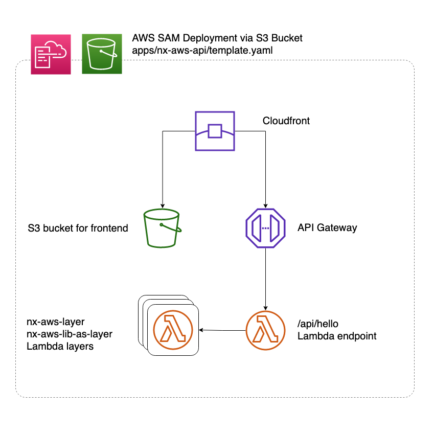
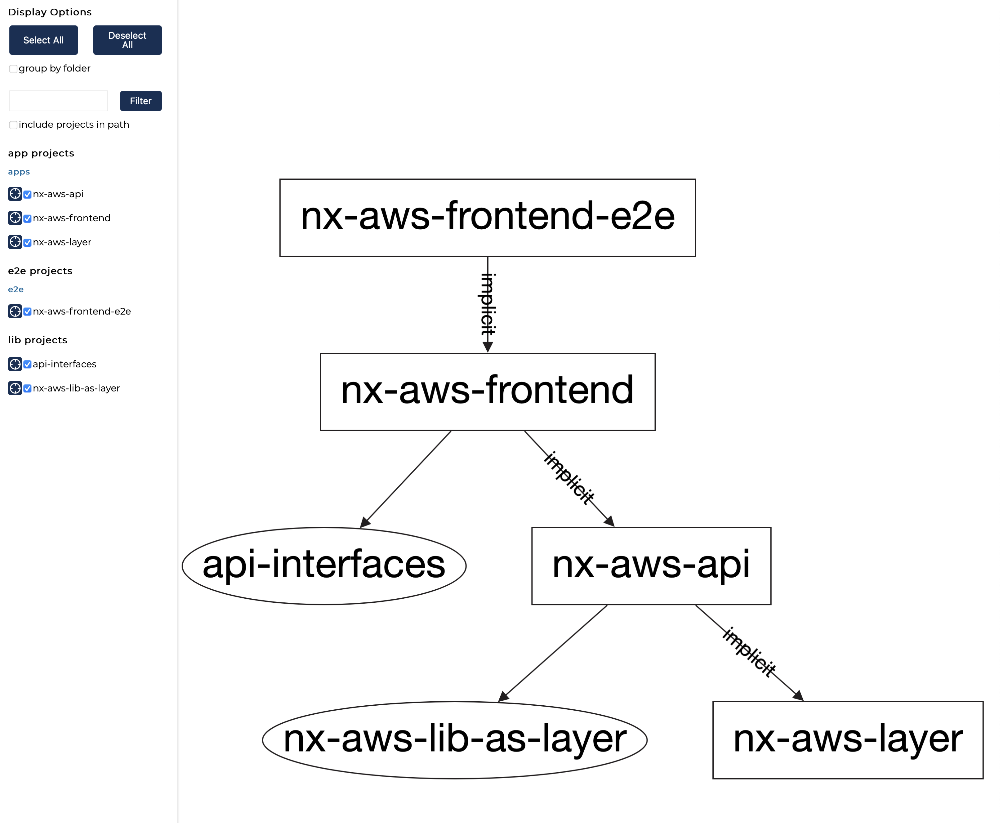

# NxAwsExample

This is a sample project for https://github.com/studds/nx-aws, powered by https://nx.dev

### Example app

This repo currently provides an example app highlighting how easy NX-AWS makes deploying frontend static sites and backend SAM applications from your mono-repo.

The frontend (nx-aws-frontend) uses Angular (Could be React, nrwl NX has excellent support for React). 

The SAM backend (nx-aws-api) depends on two lambda layers. 
  - One layer contains a custom function packaged into a layer with it's required dependencies
  - One layer is just a package.json it contains bcrypt and is built correctly for the lambda node environment

The core SAM cloudfront file is in apps/nx-aws-api/template.yaml

### Development server

- Frontend: `ng serve nx-aws-frontend`
- Backend: ** **You need to deploy the app (layers) before this will work** ** `ng serve nx-aws-api`

*** TODO add comment explaining why you need to include the layers

## Test it out

1. Install the [AWS SAM CLI](https://docs.aws.amazon.com/serverless-application-model/latest/developerguide/serverless-sam-cli-install.html)
2. Set up your [AWS command line tools with the correct credentials](https://docs.aws.amazon.com/serverless-application-model/latest/developerguide/serverless-getting-started-set-up-credentials.html) to a test account. 
3. Create an S3 bucket to hold the cloud formation config

### Build

4. `ng build nx-aws-frontend --withDeps --prod` 

The [`withDeps`](https://nx.dev/latest/angular/cli/run-many#with-deps) flag will automatically build dependencies, either explicit or
[implicit](https://nx.dev/latest/angular/getting-started/configuration#implicit-dependencies). So it will build the frontend and backend code.

The build artifacts will be stored in the `dist/` directory.
We used the `--prod` flag for a production build so all the frontend code is minified.

## Package and deploy

The backend needs separate package and deploy steps. Both package and deploy require the
[AWS SAM CLI to be installed](https://docs.aws.amazon.com/serverless-application-model/latest/developerguide/serverless-sam-cli-install.html).
You'll also need to have AWS permissions configured, and to configure an S3 bucket where deploy artefacts can be
stored - in these examples, `s3-bucket-setup-step-3`.

5. `ng run nx-aws-api:package --withDeps --s3Bucket s3-bucket-setup-step-3`
6. `ng run nx-aws-api:deploy --withDeps --s3Bucket s3-bucket-setup-step-3`

The first time you deploy the backend stack will take a while, as it deploys a CloudFront distribution.

You can then deploy the frontend app. The frontend app refers to the backend api in `angular.json` to derive the deploy bucket.
*** TODO we should expand on this

`ng run nx-aws-frontend:deploy`

## Other nx command for you to try out if you have not already

### Running unit tests

Run `ng test my-app` to execute the unit tests via [Jest](https://jestjs.io).

Run `nx affected:test` to execute the unit tests affected by a change.

### Running end-to-end tests

Run `ng e2e my-app` to execute the end-to-end tests via [Cypress](https://www.cypress.io).

Run `nx affected:e2e` to execute the end-to-end tests affected by a change.

### Understand your workspace

Run `nx dep-graph` to see a diagram of the dependencies of your projects.

### Further help

Visit the [Nx Documentation](https://nx.dev/angular) to learn more.
